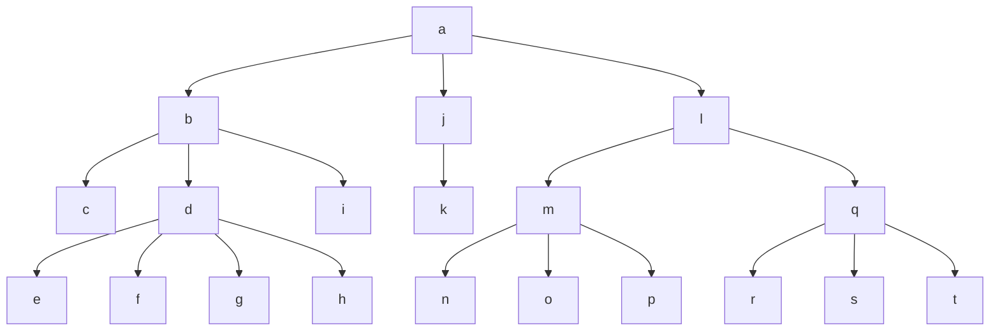

# Kapittel 10

## 10.2 Strukturell abstraksjon

Utvide implementasjon av collection med effektiv join

Idé er å representere en bootstrapped samling som en primitiv samling av andre bootstrappede samlinger

```fsharp
type 'a B = E | B of 'a * ('a B C)

let unit_B x = B (x, empty)
```
```fsharp
unit_B: 'a -> 'a B
insert: 'a B * 'a B C -> 'a B C

insert_B: 'a * 'a B -> 'a B
insert_B (x, B(y, c)) = B(x, insert(unit_B y, c))

join_B: 'a B * 'a B -> 'a B
join_B (B(x, c), b) = B(x, insert(b, c))
```


```fsharp
dc = C('d', [C('e', []); C('f', []); C('g', []); C('h', [])])
mc = C('m', [C('n', []); C('o', []); C('p', [])])
qc = C('q', [C('r', []); C('s', []); C('t', [])])
t = C('a', [C('b', [C('c', []); dc; C('i', [])]); C('j', [C('k', [])]); C('l', [mc; qc])]
```
