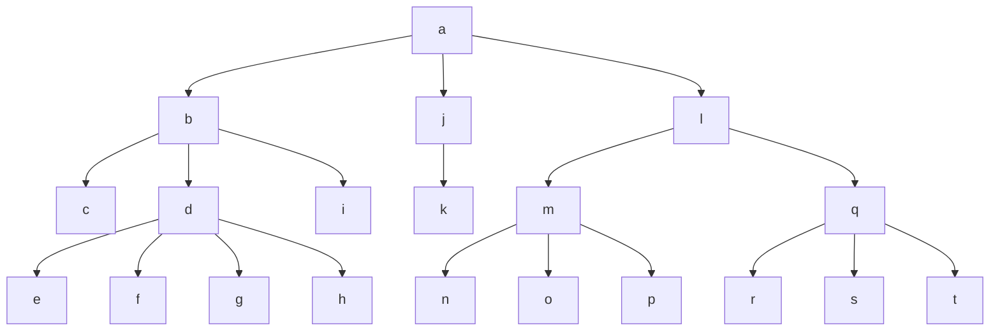

# Kapittel 10

## 10.2 Strukturell abstraksjon

Utvide implementasjon av collection med effektiv join

Idé er å representere en bootstrapped samling som en primitiv samling av andre bootstrappede samlinger

```fsharp
type 'a B = E | B of 'a * ('a B C)

let unit_B x = B (x, empty)
```
```fsharp
unit_B: 'a -> 'a B
insert: 'a B * 'a B C -> 'a B C

insert_B: 'a * 'a B -> 'a B
insert_B (x, B(y, c)) = B(x, insert(unit_B y, c))

join_B: 'a B * 'a B -> 'a B
join_B (B(x, c), b) = B(x, insert(b, c))
```


```fsharp
dc = C('d', [C('e', []); C('f', []); C('g', []); C('h', [])])
mc = C('m', [C('n', []); C('o', []); C('p', [])])
qc = C('q', [C('r', []); C('s', []); C('t', [])])
t = C('a', [C('b', [C('c', []); dc; C('i', [])]); C('j', [C('k', [])]); C('l', [mc; qc])]
```


### Teorem 10.1

Vil vise at `++` og `tail` kjører i O(1) amortisert tid med bankers metode

Amortisert kost = unshared cost + # debits discharged

unshared cost = O(1), må vise at discharger bare O(1) debits

To debit invarianter:
* Antall debits i node `i` er begrenset av graden til `i`.
    * Grad = #barn, sum av gradene i alle nodene er størrelsen på treet minus 1, `|T| - 1`
    * Vedlikeholder denne invarianten ved kun å øke debits i en node når også graden økes
* `D_t(i)`, summen av alle debits av alle noder opp til og inkludert `i`, skal være begrenset av en lineær funksjon på `i`
    * `D_t(i) <= i + depth_t(i)`

#### Bevis
`(++)`: `t_1 ++ t_2`, `|t_1| = n` index, dybde og cumulativ debit påvirkes ikke for nodene i `t_1`. For noder i `t_2` øker ideksen med n, dybde med n (legges inn under rota til `t_1`), og akumulerer totale debits fra `t_1`
